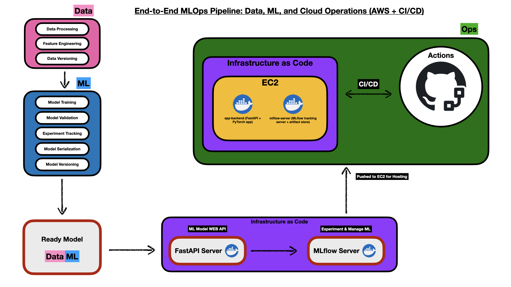

# MLOps Pipeline on AWS 🚀

**End-to-end machine learning pipeline with CI/CD, Docker, MLflow, FastAPI, and AWS EC2. Fully reproducible via Terraform.**

---

## End-to-End MLOps Pipeline

**How it works:**  
Code, models, and infra are versioned and deployed automatically from GitHub to AWS EC2 using CI/CD, with Docker and Terraform for full reproducibility.

## Overview

- **Data ➡️ ML ➡️ Ops:** Modern MLOps stack, everything containerized and automated
- **Cloud-Ready:** Infrastructure on AWS (EC2), code + infra managed as code
- **CI/CD:** Automatic deployments with GitHub Actions

---

## Stack

- **Backend:** FastAPI, PyTorch, MLflow (tracking server)
- **Orchestration:** Docker, Terraform, GitHub Actions
- **Cloud:** AWS EC2

---

## Key Features

- **Automated infra:** Deploy everything with one command via Terraform
- **Containerized apps:** No more “works on my machine”
- **Experiment tracking:** MLflow server for metrics, params, and models
- **CI/CD:** Push to `main` → Deploys to EC2

---

## Quickstart

1. **Clone repo**
2. **Set up AWS & Terraform**
3. **Update configs (.tf, Docker, secrets)**
4. **`terraform apply`**
5. **Push to `main` → auto-deploy**

---

## Repo Structure

- `app-backend/` — FastAPI ML API
- `mlflow/` — MLflow server (Docker)
- `terraform/` — Infra-as-code scripts
- `.github/workflows/` — CI/CD pipeline

---

## Notes

- **No secrets or keys tracked in Git**
- **For demo/prototype—secure & productionize as needed**

---

**Built for learning & showcasing.**
